# 14/09/26

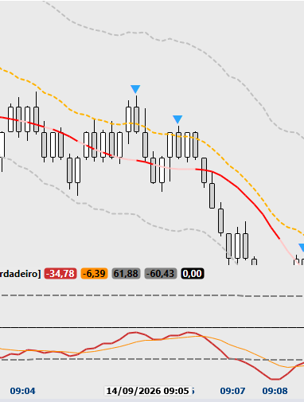
2 oportunidades T2 perdidas por medo (não tem como saber o que vai acontecer, achar que um trade não vai funcionar é um erro psicológico)

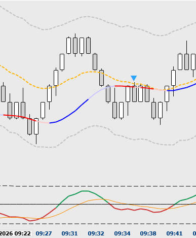
Mais uma oportunidadem desta vez uma T1 perdida

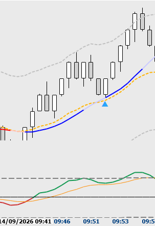
Oportunidade Perdido novamente, uma T1 ganhadora

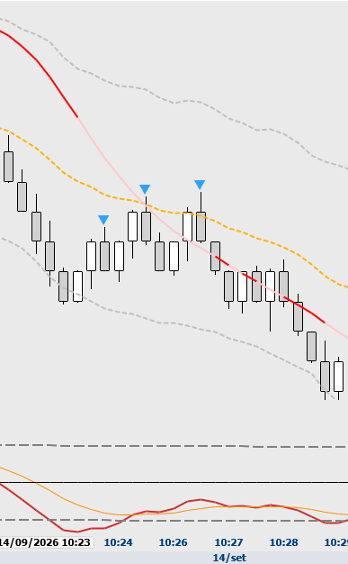
T1 e depois T2, perdidas, por medo.

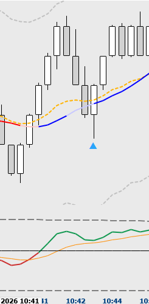
Operação T1 Clara, ganhadora, perdida por medo

# 15/09/26

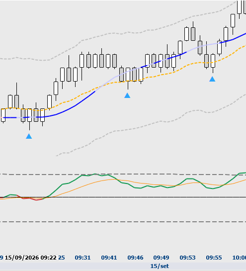
T1 Perdida, T2 Perdida, ambas ganhadoras.

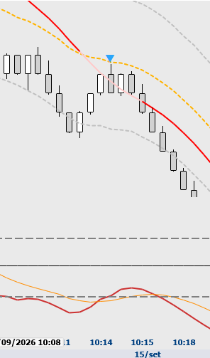
Trade de quase toque na 21, dava para tomar, trader T1 perdido

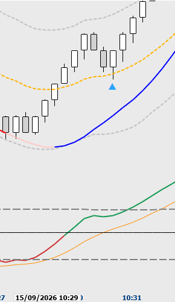
Trade T1 perdido, ganhador.

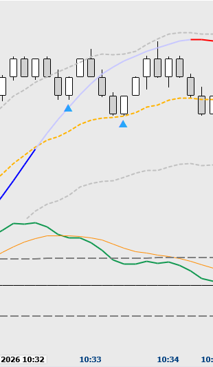
Trade T1 Difícil, teria que ter entrado a mercado.

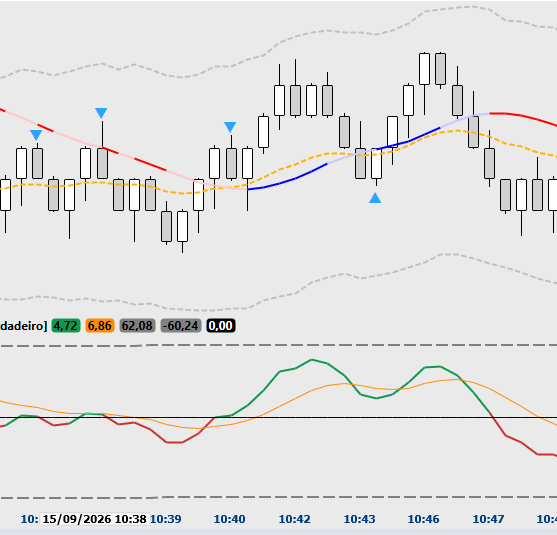
Último trade é um T1 claro, ganhador.

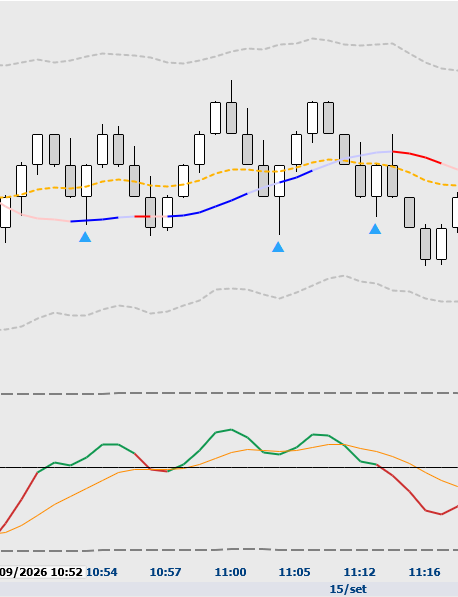
T1 Breakeven, T1 breakeven, T2 Loss.

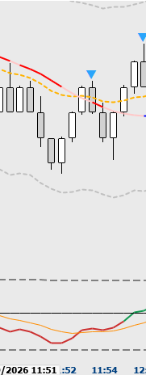
Trade T1 de venda, Breakeven.

# 16/09/26

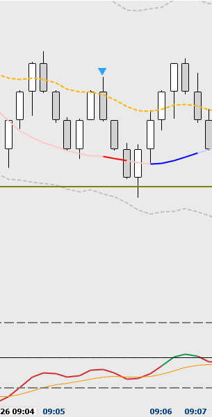
T2, teria dado BREAKEVEN

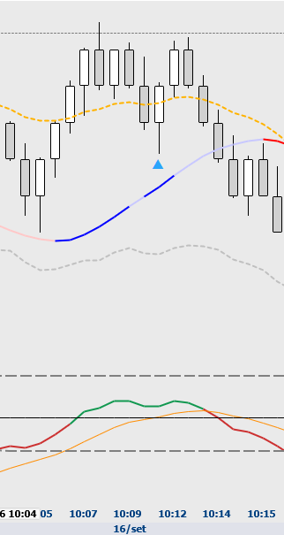
T1, porem expectativa baixista forte, BREAKEVEN

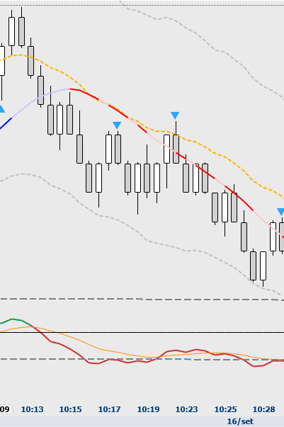
Trade T1 perdido, ganhador (foi tentado, sem recuo suficiente)

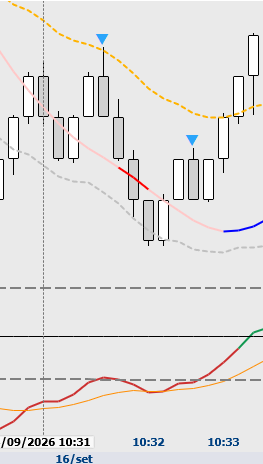
Trade T2 Ganhador.

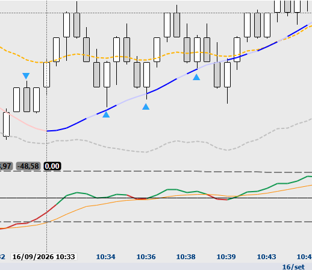
Último trade é um T1, perdedor.

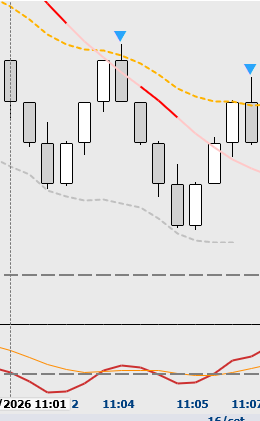
T1Dificil (sem recuo) Gain

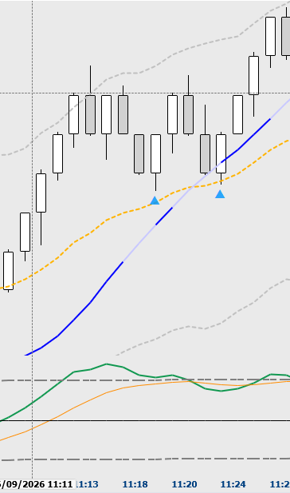
Trade T1, Gain

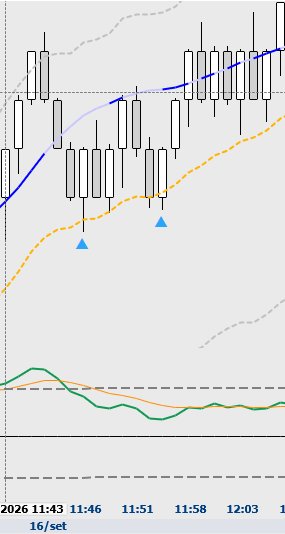
T2 e T2, Gain.

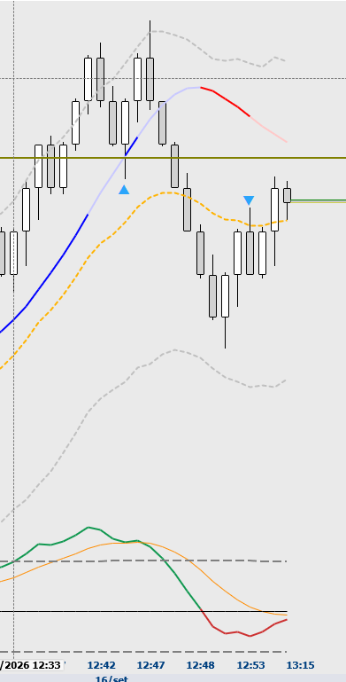
Trade T1, Loss

