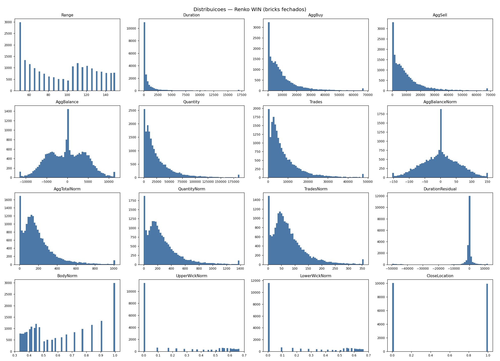
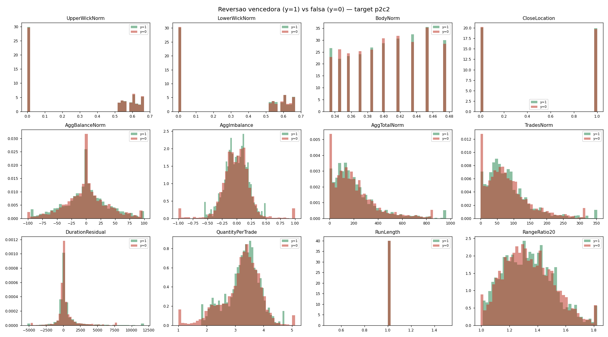

# 04 — Analise exploratoria

## Taxa-base dos eventos de reversao

| target | pre | cont | exato | candidatos | cand/dia | taxa-base | up | down |
|---|---|---|---|---|---|---|---|---|
| `p2c2` | 2 | 2 | False | 4343 | 124.09 | 0.4611 | 0.4633 | 0.4589 |
| `p2c3` | 2 | 3 | False | 4343 | 124.09 | 0.3118 | 0.3109 | 0.3128 |
| `p3c2` | 3 | 2 | False | 2898 | 82.8 | 0.4805 | 0.4902 | 0.4710 |
| `p3c3` | 3 | 3 | False | 2898 | 82.8 | 0.3186 | 0.3247 | 0.3126 |
| `p2c2e` | 2 | 2 | True | 1445 | 41.29 | 0.4221 | 0.4097 | 0.4345 |
| `p3c2e` | 3 | 2 | True | 929 | 26.54 | 0.4790 | 0.5213 | 0.4401 |

## Probabilidades incondicionais

- `p_direction_change`: 0.3198
- `p_next_same_dir`: 0.6802
- `p_next2_same_dir`: 0.4631
- `p_next3_same_dir`: 0.3182
- `mean_run_length`: 3.1270

## Estrutura Renko por grupo (medias)

| grupo | Range | BodyNorm | UpperWickNorm | LowerWickNorm | AggTotalNorm | AggBalanceNorm | DurationResidual |
|---|---|---|---|---|---|---|---|
| continuidade | 78.7191 | 0.7120 | 0.1483 | 0.1398 | 191.9194 | -1.9903 | -765.9551 |
| reversao | 125.8147 | 0.4025 | 0.2988 | 0.2987 | 201.4888 | -0.2190 | 1629.8594 |
| reversao_vencedora | 125.7867 | 0.4027 | 0.3000 | 0.2973 | 214.8881 | -0.0502 | 5032.6622 |
| reversao_falsa | 126.0556 | 0.4017 | 0.3025 | 0.2959 | 208.4966 | -0.1567 | -128.4414 |

## Top features condicionais (target p2c2, |AUC-0.5|)

| feature | lag | AUC | Cohen d | media y=1 | media y=0 |
|---|---|---|---|---|---|
| `RangeRatio20` | 1 | 0.5264 | 0.0716 | 0.8554 | 0.8340 |
| `RangeMean5` | 2 | 0.4746 | -0.0848 | 93.6567 | 94.9192 |
| `RunLength` | 1 | 0.5253 | 0.0668 | 4.2378 | 4.0415 |
| `RunLength` | 2 | 0.5253 | 0.0668 | 3.2378 | 3.0415 |
| `AggTotalPerTrade` | 2 | 0.5252 | 0.0787 | 2.4687 | 2.4148 |
| `Range` | 2 | 0.4762 | -0.0805 | 93.1144 | 95.7821 |
| `WickTotalNorm` | 2 | 0.4762 | -0.0854 | 0.3827 | 0.4024 |
| `BodyNorm` | 2 | 0.5238 | 0.0854 | 0.6173 | 0.5976 |
| `BodyNorm` | 1 | 0.4769 | -0.0800 | 0.7042 | 0.7219 |
| `Range` | 1 | 0.5231 | 0.0609 | 79.4905 | 77.7564 |
| `WickTotalNorm` | 1 | 0.5231 | 0.0800 | 0.2958 | 0.2781 |
| `AggTotalPerQuantity` | 0 | 0.4774 | -0.0627 | 0.7450 | 0.7522 |
| `AggShareOfQuantity` | 0 | 0.4774 | -0.0627 | 0.7450 | 0.7522 |
| `AggPerBrickProgress` | 1 | 0.5222 | 0.0421 | 345.0551 | 328.1417 |
| `AggTotalRatio20` | 1 | 0.5220 | 0.0967 | 0.9325 | 0.8512 |
| `AggTotalNormMean3` | 1 | 0.5217 | 0.0852 | 200.1989 | 188.2484 |
| `RangeRatio20` | 2 | 0.4786 | -0.0695 | 0.9934 | 1.0175 |
| `TradesRatio20` | 1 | 0.5209 | 0.0915 | 0.9197 | 0.8439 |
| `AggSellNorm` | 1 | 0.5205 | 0.0457 | 97.0858 | 92.9495 |
| `QuantityRatio20` | 1 | 0.5203 | 0.0723 | 0.8990 | 0.8383 |
| `AggBuyNorm` | 1 | 0.5196 | 0.0429 | 96.5653 | 92.7639 |
| `AggSellNorm` | 2 | 0.5193 | 0.0582 | 101.7580 | 96.2176 |
| `TradesNorm` | 1 | 0.5192 | 0.0526 | 76.4355 | 73.2158 |
| `HourOfDay` | 2 | 0.5191 | 0.0650 | 11.1897 | 11.0471 |
| `HourOfDay` | 0 | 0.5190 | 0.0637 | 11.2156 | 11.0739 |

## Pares altamente correlacionados (|r| > 0.95)

- `Direction` ~ `CloseLocation` : r = 1.0000
- `AggTotalPerQuantity` ~ `AggShareOfQuantity` : r = 1.0000
- `BodyNorm` ~ `WickTotalNorm` : r = -1.0000
- `DurationRatio20` ~ `DurationResidualPct` : r = 0.9928
- `QuantityResidual20` ~ `AggTotalResidual20` : r = 0.9925
- `QuantityResidual20` ~ `TradesResidual20` : r = 0.9880
- `TradesResidual20` ~ `AggTotalResidual20` : r = 0.9870
- `AggTotalNorm` ~ `QuantityNorm` : r = 0.9845
- `AggTotalNorm` ~ `TradesNorm` : r = 0.9802
- `SecondsSinceSessionOpen` ~ `HourOfDay` : r = 0.9785
- `QuantityNorm` ~ `TradesNorm` : r = 0.9778
- `Range` ~ `BodyNorm` : r = -0.9645
- `Range` ~ `WickTotalNorm` : r = 0.9645
- `BodyNormMean5` ~ `RangeMean5` : r = -0.9626
- `Range` ~ `RangeRatio20` : r = 0.9602
- `QuantityRatio20` ~ `TradesRatio20` : r = 0.9591
- `TradesRatio20` ~ `AggTotalRatio20` : r = 0.9589

