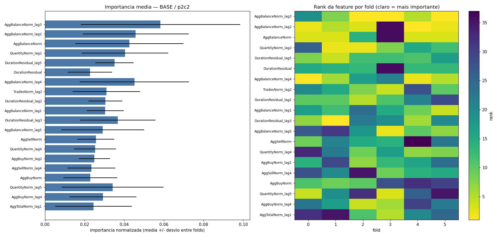
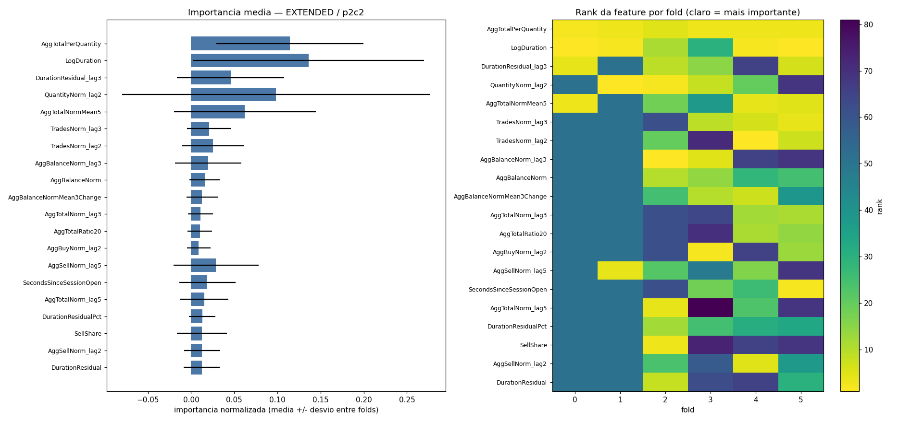
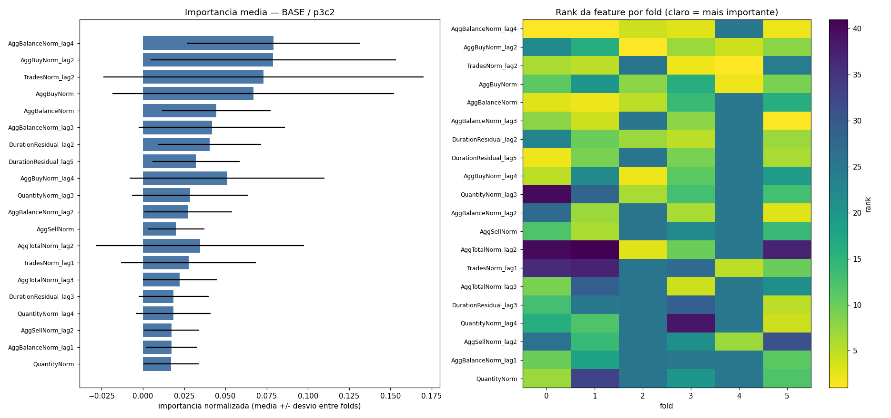
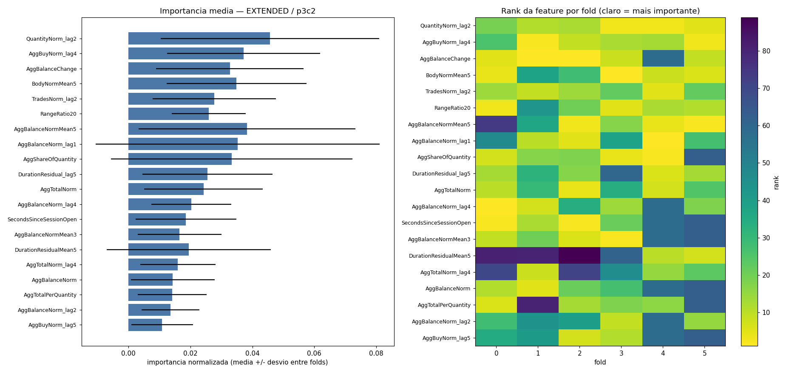

# 07 — Importancia e estabilidade das features

Uma feature so e considerada util se estiver no top-15 em pelo menos 80% dos folds do walk-forward (secao 22).

## p2c2|BASE

- folds: 6
- **features estaveis**: `AggBalanceNorm_lag3`, `AggBalanceNorm_lag2`, `AggBalanceNorm`, `QuantityNorm_lag2`, `DurationResidual_lag5`, `DurationResidual`
- importantes em <50% dos folds (suspeitas): `QuantityNorm_lag5`, `AggBuyNorm_lag4`, `AggTotalNorm_lag1`, `AggTotalNorm_lag3`, `TradesNorm_lag4`, `AggBuyNorm_lag5`, `AggSellNorm_lag3`, `AggTotalNorm`, `DurationResidual_lag4`, `QuantityNorm_lag1`, `AggSellNorm_lag2`, `QuantityNorm`, `TradesNorm_lag1`, `AggSellNorm_lag5`, `TradesNorm_lag3`

| feature | imp. media | desvio | CV | rank medio | top-15 em |
|---|---|---|---|---|---|
| `AggBalanceNorm_lag3` | 0.0583 | 0.0401 | 0.69 | 5.8 | 5/6 |
| `AggBalanceNorm_lag2` | 0.0458 | 0.0268 | 0.58 | 8.2 | 5/6 |
| `AggBalanceNorm` | 0.0426 | 0.0274 | 0.64 | 10.3 | 5/6 |
| `QuantityNorm_lag2` | 0.0404 | 0.0218 | 0.54 | 10.8 | 5/6 |
| `DurationResidual_lag5` | 0.0351 | 0.0096 | 0.27 | 10.7 | 5/6 |
| `DurationResidual` | 0.0227 | 0.0112 | 0.50 | 17.3 | 5/6 |
| `AggBalanceNorm_lag4` | 0.0451 | 0.0275 | 0.61 | 8.7 | 4/6 |
| `TradesNorm_lag2` | 0.0310 | 0.0170 | 0.55 | 14.2 | 4/6 |
| `DurationResidual_lag2` | 0.0305 | 0.0086 | 0.28 | 14.3 | 4/6 |
| `AggBalanceNorm_lag1` | 0.0304 | 0.0094 | 0.31 | 13.5 | 4/6 |
| `DurationResidual_lag3` | 0.0367 | 0.0190 | 0.52 | 12.5 | 3/6 |
| `AggBalanceNorm_lag5` | 0.0292 | 0.0208 | 0.71 | 15.8 | 3/6 |
| `AggSellNorm` | 0.0257 | 0.0094 | 0.36 | 19.8 | 3/6 |
| `QuantityNorm_lag4` | 0.0253 | 0.0106 | 0.42 | 16.0 | 3/6 |
| `AggBuyNorm_lag2` | 0.0249 | 0.0078 | 0.31 | 17.2 | 3/6 |

SHAP (top 8): `AggBalanceNorm_lag5` (0.0034), `DurationResidual_lag3` (0.0027), `TradesNorm_lag1` (0.0024), `AggBalanceNorm_lag1` (0.0022), `DurationResidual_lag4` (0.0000), `DurationResidual_lag5` (0.0000), `TradesNorm_lag5` (0.0000), `TradesNorm_lag4` (0.0000)

## p2c2|EXTENDED

- folds: 6
- **features estaveis**: `AggTotalPerQuantity`, `LogDuration`
- importantes em <50% dos folds (suspeitas): `TradesNorm_lag2`, `AggBalanceNorm_lag3`, `AggBalanceNorm`, `AggBalanceNormMean3Change`, `AggTotalNorm_lag3`, `AggTotalRatio20`, `AggBuyNorm_lag2`, `AggSellNorm_lag5`, `SecondsSinceSessionOpen`, `AggTotalNorm_lag5`, `DurationResidualPct`, `SellShare`, `AggSellNorm_lag2`, `DurationResidual`, `DurationResidualMean5`

| feature | imp. media | desvio | CV | rank medio | top-15 em |
|---|---|---|---|---|---|
| `AggTotalPerQuantity` | 0.1144 | 0.0853 | 0.75 | 3.2 | 6/6 |
| `LogDuration` | 0.1360 | 0.1338 | 0.98 | 7.8 | 5/6 |
| `DurationResidual_lag3` | 0.0458 | 0.0622 | 1.36 | 25.1 | 4/6 |
| `QuantityNorm_lag2` | 0.0986 | 0.1783 | 1.81 | 25.1 | 3/6 |
| `AggTotalNormMean5` | 0.0623 | 0.0820 | 1.32 | 19.8 | 3/6 |
| `TradesNorm_lag3` | 0.0210 | 0.0257 | 1.22 | 30.4 | 3/6 |
| `TradesNorm_lag2` | 0.0252 | 0.0356 | 1.41 | 33.5 | 2/6 |
| `AggBalanceNorm_lag3` | 0.0198 | 0.0383 | 1.93 | 40.3 | 2/6 |
| `AggBalanceNorm` | 0.0157 | 0.0174 | 1.11 | 29.8 | 2/6 |
| `AggBalanceNormMean3Change` | 0.0128 | 0.0182 | 1.42 | 30.5 | 2/6 |
| `AggTotalNorm_lag3` | 0.0109 | 0.0146 | 1.35 | 41.8 | 2/6 |
| `AggTotalRatio20` | 0.0101 | 0.0141 | 1.40 | 43.1 | 2/6 |
| `AggBuyNorm_lag2` | 0.0088 | 0.0137 | 1.55 | 40.7 | 2/6 |
| `AggSellNorm_lag5` | 0.0290 | 0.0491 | 1.70 | 34.9 | 1/6 |
| `SecondsSinceSessionOpen` | 0.0190 | 0.0325 | 1.72 | 34.9 | 1/6 |

SHAP (top 8): `AggBalanceNormMean3Change` (0.0046), `AggTotalNormMean5` (0.0045), `DurationResidual_lag3` (0.0033), `AggTotalPerQuantity` (0.0031), `LogDuration` (0.0031), `AggBalanceNorm_lag1` (0.0013), `QuantityPerTrade` (0.0012), `DurationResidual_lag2` (0.0000)

## p3c2|BASE

- folds: 6
- **features estaveis**: `AggBalanceNorm_lag4`
- importantes em <50% dos folds (suspeitas): `AggTotalNorm_lag2`, `TradesNorm_lag1`, `AggTotalNorm_lag3`, `DurationResidual_lag3`, `QuantityNorm_lag4`, `AggSellNorm_lag2`, `AggBalanceNorm_lag1`, `QuantityNorm`, `DurationResidual_lag4`, `DurationResidual`, `TradesNorm_lag3`, `DurationResidual_lag1`, `TradesNorm`, `AggSellNorm_lag5`, `AggBuyNorm_lag1`

| feature | imp. media | desvio | CV | rank medio | top-15 em |
|---|---|---|---|---|---|
| `AggBalanceNorm_lag4` | 0.0791 | 0.0525 | 0.66 | 6.0 | 5/6 |
| `AggBuyNorm_lag2` | 0.0790 | 0.0745 | 0.94 | 9.7 | 4/6 |
| `TradesNorm_lag2` | 0.0730 | 0.0971 | 1.33 | 10.6 | 4/6 |
| `AggBuyNorm` | 0.0669 | 0.0852 | 1.27 | 11.0 | 4/6 |
| `AggBalanceNorm` | 0.0445 | 0.0330 | 0.74 | 10.8 | 4/6 |
| `AggBalanceNorm_lag3` | 0.0418 | 0.0443 | 1.06 | 11.9 | 4/6 |
| `DurationResidual_lag2` | 0.0404 | 0.0312 | 0.77 | 12.8 | 4/6 |
| `DurationResidual_lag5` | 0.0321 | 0.0265 | 0.82 | 12.8 | 4/6 |
| `AggBuyNorm_lag4` | 0.0511 | 0.0591 | 1.16 | 14.0 | 3/6 |
| `QuantityNorm_lag3` | 0.0285 | 0.0351 | 1.23 | 20.8 | 3/6 |
| `AggBalanceNorm_lag2` | 0.0274 | 0.0265 | 0.97 | 15.6 | 3/6 |
| `AggSellNorm` | 0.0201 | 0.0171 | 0.85 | 17.4 | 3/6 |
| `AggTotalNorm_lag2` | 0.0345 | 0.0631 | 1.83 | 26.0 | 2/6 |
| `TradesNorm_lag1` | 0.0276 | 0.0409 | 1.48 | 23.4 | 2/6 |
| `AggTotalNorm_lag3` | 0.0223 | 0.0223 | 1.00 | 18.9 | 2/6 |

SHAP (top 8): `AggBuyNorm_lag2` (0.0069), `TradesNorm_lag2` (0.0054), `AggBalanceNorm` (0.0048), `AggBalanceNorm_lag4` (0.0040), `AggBuyNorm` (0.0037), `DurationResidual_lag2` (0.0037), `TradesNorm` (0.0017), `DurationResidual_lag4` (0.0000)

## p3c2|EXTENDED

- folds: 6
- **features estaveis**: `QuantityNorm_lag2`, `AggBuyNorm_lag4`, `AggBalanceChange`
- importantes em <50% dos folds (suspeitas): `DurationResidualMean5`, `AggTotalNorm_lag4`, `AggBalanceNorm`, `AggTotalPerQuantity`, `AggBalanceNorm_lag2`, `AggBuyNorm_lag5`, `AggSellNorm_lag5`, `DurationResidualMean3`, `AggTotalNorm_lag2`, `DurationResidual_lag3`, `AggTotalNormMean5`, `DurationResidual_lag2`, `DurationResidual_lag4`, `RangeMean5`, `AggSellNorm_lag4`

| feature | imp. media | desvio | CV | rank medio | top-15 em |
|---|---|---|---|---|---|
| `QuantityNorm_lag2` | 0.0457 | 0.0353 | 0.77 | 8.8 | 5/6 |
| `AggBuyNorm_lag4` | 0.0372 | 0.0247 | 0.66 | 10.8 | 5/6 |
| `AggBalanceChange` | 0.0327 | 0.0238 | 0.73 | 13.7 | 5/6 |
| `BodyNormMean5` | 0.0349 | 0.0226 | 0.65 | 14.2 | 4/6 |
| `TradesNorm_lag2` | 0.0277 | 0.0199 | 0.72 | 14.3 | 4/6 |
| `RangeRatio20` | 0.0259 | 0.0119 | 0.46 | 15.7 | 4/6 |
| `AggBalanceNormMean5` | 0.0383 | 0.0350 | 0.91 | 22.8 | 3/6 |
| `AggBalanceNorm_lag1` | 0.0353 | 0.0458 | 1.30 | 21.3 | 3/6 |
| `AggShareOfQuantity` | 0.0334 | 0.0390 | 1.17 | 18.4 | 3/6 |
| `DurationResidual_lag5` | 0.0255 | 0.0210 | 0.82 | 23.5 | 3/6 |
| `AggTotalNorm` | 0.0242 | 0.0192 | 0.79 | 18.3 | 3/6 |
| `AggBalanceNorm_lag4` | 0.0203 | 0.0129 | 0.64 | 22.0 | 3/6 |
| `SecondsSinceSessionOpen` | 0.0185 | 0.0163 | 0.88 | 26.2 | 3/6 |
| `AggBalanceNormMean3` | 0.0165 | 0.0135 | 0.82 | 26.2 | 3/6 |
| `DurationResidualMean5` | 0.0194 | 0.0265 | 1.36 | 54.8 | 2/6 |

SHAP (top 8): `QuantityNorm_lag2` (0.0084), `AggBalanceNorm_lag1` (0.0078), `AggBalanceNormMean5` (0.0074), `HourOfDay` (0.0068), `TradesNorm_lag2` (0.0066), `BodyNormMean5` (0.0059), `RangeMean5` (0.0055), `AggTotalNorm_lag2` (0.0053)

