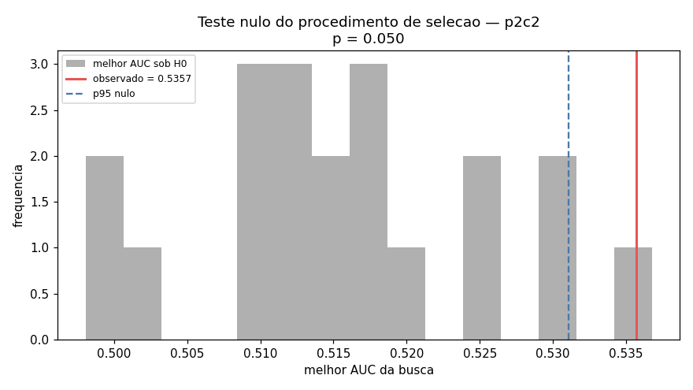

# 09 — Robustez e estabilidade (`p2c2`)

## Teste nulo do procedimento de selecao

- melhor AUC observado: **0.5357**
- configuracoes por busca: 8
- permutacoes em bloco (bloco=40): 20
- melhor AUC sob H0: media 0.5157, desvio 0.0099, p95 0.5311, max 0.5368
- **p-valor = 0.0500**

## Estabilidade do desenho do target

| target | n | taxa-base | AUC | precision | edge | AUC/fold | desvio | folds>0.5 |
|---|---|---|---|---|---|---|---|---|
| `p2c2` | 2248 | 0.4537 | 0.5286 | 0.4806 | +0.0268 | 0.5332 | 0.0647 | 4/6 |
| `p2c3` | 2248 | 0.3172 | 0.5249 | 0.5556 | +0.2384 | 0.5281 | 0.0599 | 3/6 |
| `p3c2` | 1485 | 0.4761 | 0.5061 | 0.4754 | -0.0007 | 0.4986 | 0.0226 | 2/6 |
| `p3c3` | 1485 | 0.3253 | 0.5085 | 0.5000 | +0.1747 | 0.5093 | 0.0264 | 4/6 |
| `p2c2e` | 763 | 0.4102 | 0.5936 | 0.5000 | +0.0898 | 0.5612 | 0.0938 | 4/6 |
| `p3c2e` | 464 | 0.4892 | 0.5391 | 0.5144 | +0.0252 | 0.5370 | 0.0477 | 4/6 |

## Desempenho por direcao

| side | n | taxa-base | AUC | precision | sinais | edge |
|---|---|---|---|---|---|---|
| -1 | 1149 | 0.4439 | 0.5155 | 0.4473 | 237 | +0.0034 |
| 1 | 1099 | 0.4641 | 0.5391 | 0.5000 | 406 | +0.0359 |

## Desempenho por mes

| month | n | taxa-base | AUC | precision | sinais | edge |
|---|---|---|---|---|---|---|
| 2026-07 | 1903 | 0.4535 | 0.5438 | 0.4944 | 540 | +0.0409 |
| 2026-08 | 345 | 0.4551 | 0.4403 | 0.4078 | 103 | -0.0473 |

## Desempenho por horario

| hour | n | taxa-base | AUC | precision | sinais | edge |
|---|---|---|---|---|---|---|
| 9 | 803 | 0.4346 | 0.5739 | 0.4698 | 215 | +0.0351 |
| 10 | 612 | 0.4690 | 0.4704 | 0.5000 | 134 | +0.0310 |
| 11 | 252 | 0.3929 | 0.4689 | 0.3585 | 53 | -0.0344 |
| 12 | 161 | 0.5093 | 0.5353 | 0.5625 | 48 | +0.0532 |
| 13 | 86 | 0.5349 | 0.5533 | 0.5429 | 35 | +0.0080 |
| 14 | 98 | 0.4796 | 0.4664 | 0.4524 | 42 | -0.0272 |
| 15 | 93 | 0.5054 | 0.5754 | 0.5769 | 52 | +0.0715 |
| 16 | 67 | 0.4478 | 0.4892 | 0.4286 | 35 | -0.0192 |
| 17 | 50 | 0.4200 | 0.4696 | 0.4000 | 20 | -0.0200 |

## Desempenho por duracao

| duration_regime | n | taxa-base | AUC | precision | sinais | edge |
|---|---|---|---|---|---|---|
| lenta | 1104 | 0.4611 | 0.4837 | 0.4554 | 336 | -0.0057 |
| normal | 923 | 0.4431 | 0.5965 | 0.5236 | 233 | +0.0805 |
| rapida | 221 | 0.4615 | 0.4600 | 0.4595 | 74 | -0.0021 |

## Desempenho por volatilidade

| vol_regime | n | taxa-base | AUC | precision | sinais | edge |
|---|---|---|---|---|---|---|
| alta | 750 | 0.4560 | 0.5302 | 0.4628 | 188 | +0.0068 |
| baixa | 733 | 0.4475 | 0.5415 | 0.4907 | 214 | +0.0432 |
| media | 765 | 0.4575 | 0.5158 | 0.4855 | 241 | +0.0280 |